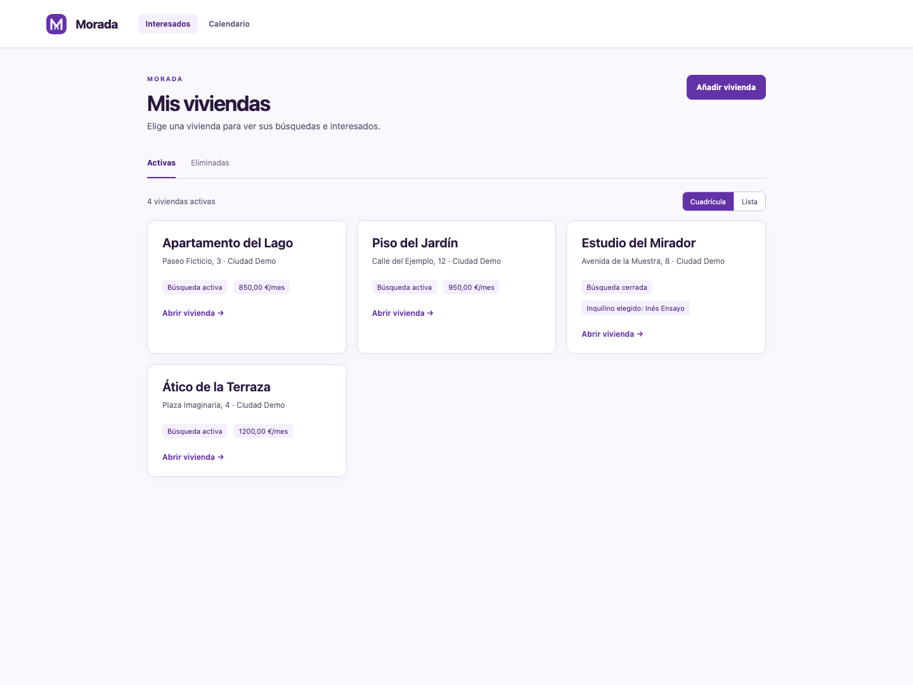
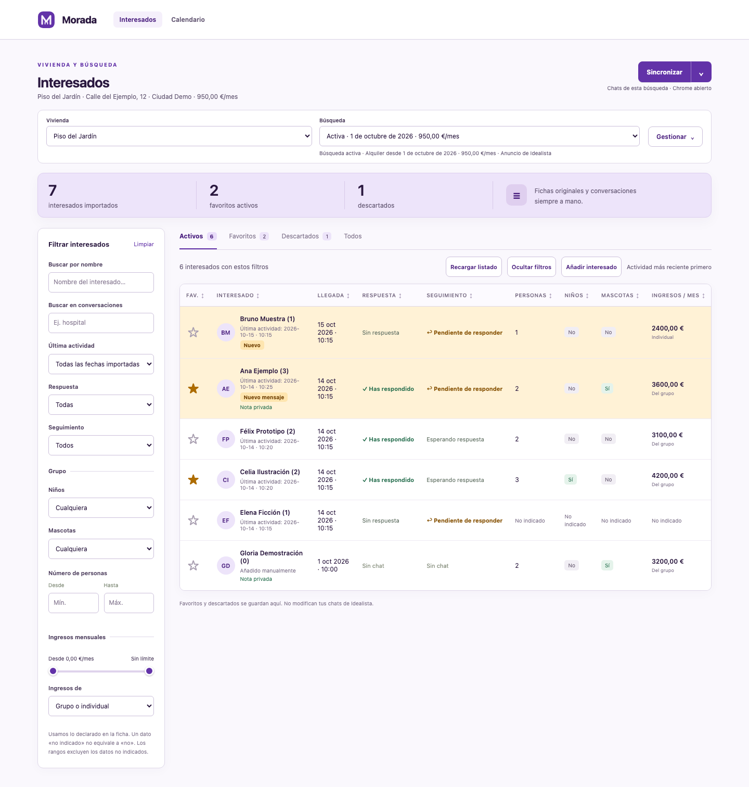
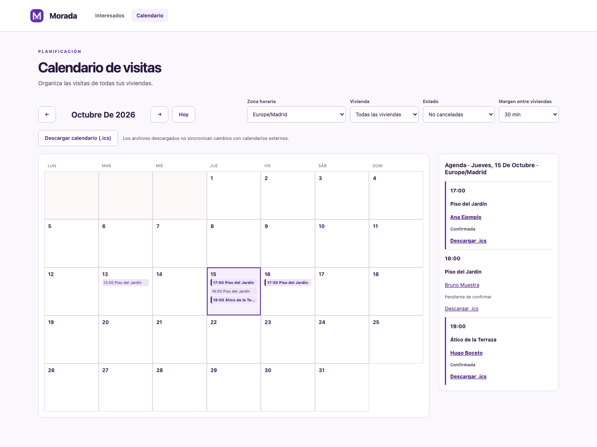

# Morada

**Morada** reúne los interesados de tus anuncios de Idealista para compararlos y seguir cada búsqueda de alquiler. Guarda tus notas, favoritos y decisiones en un espacio privado; los mensajes se responden siempre desde Idealista.

La [galería de pantallas](docs/GALERIA.md) recorre las vistas, formularios y versión móvil. Todas las capturas usan datos inventados en una base de demostración independiente.

## Empezar

En **Mis viviendas**, pulsa **Añadir vivienda**. Desde el espacio de trabajo también puedes elegir **Gestionar → Añadir vivienda**. Escribe un nombre reconocible, la fecha desde la que buscas inquilino y, si quieres, la dirección, el alquiler y la URL del anuncio de Idealista. La URL es opcional: sin ella también puedes crear interesados manualmente.

Para traer conversaciones necesitas **Google Chrome en macOS**, con tu sesión de Idealista abierta en la página de conversaciones y usando el mismo perfil de Chrome. La primera vez activa **Ver → Desarrollador → Permitir JavaScript desde eventos de Apple**. La aplicación lee las conversaciones para organizarlas; no envía respuestas.

## Viviendas y búsquedas

Alterna entre **Cuadrícula** y **Lista** en Mis viviendas. Abre una vivienda para ver sus búsquedas e interesados, o elige **Gestionar → Editar vivienda** para cambiar su nombre o dirección.

Cada vivienda tiene una búsqueda activa, con fecha de inicio, alquiler y URL del anuncio. Desde **Editar búsqueda** puedes corregir esos datos. Cuando hayas decidido, abre la ficha de la persona elegida y pulsa **Elegir inquilino y cerrar búsqueda**. La búsqueda queda en el histórico, con sus interesados, conversaciones, favoritos, descartes y notas, para consultarla sin mezclarla con la siguiente.

Mientras no abras una nueva búsqueda, **Mis viviendas** muestra el inquilino elegido en la última búsqueda cerrada, tanto en cuadrícula como en lista. Dentro de cada búsqueda cerrada puedes abrir su ficha con **Ver ficha del inquilino elegido**, aunque los filtros del listado no lo muestren.

Si la elección no sale adelante, usa **Gestionar → Reabrir búsqueda** y confirma la reapertura. Se retira el inquilino elegido y recuperas la misma búsqueda, con todos sus interesados, chats, notas, favoritos y visitas. Puedes seguir sincronizando y elegir a otra persona; la ficha anterior se conserva sin descartarla automáticamente. Solo se puede reabrir la última búsqueda si no has creado otra después y su anuncio no está vinculado a otra vivienda activa.

Para iniciar otro proceso de alquiler independiente, pulsa **Nueva búsqueda**. Indica una nueva fecha, alquiler y, si corresponde, URL: empieza con una lista distinta y conserva el histórico anterior separado. Los chats anteriores siguen disponibles al seleccionar su búsqueda cerrada.

Desde **Gestionar → Editar vivienda** puedes eliminar una vivienda. Aparecerá en **Eliminadas** y podrás restaurarla. **Eliminar definitivamente** pide confirmación y la borra de la aplicación junto con sus búsquedas, interesados, conversaciones y notas; las copias y exportaciones que ya existieran no se alteran.

## Interesados y conversaciones

Puedes crear una ficha con **Añadir interesado** y completar nombre, contacto, personas, niños, mascotas, ingresos y notas privadas.

### Visitas

Cuando una persona quiera ver la vivienda, abre su ficha y pulsa **Programar visita**. La cita se crea manualmente: Morada no interpreta ni confirma automáticamente los mensajes del chat. Empieza en **Pendiente de confirmar**, dura 30 minutos por defecto y puedes marcarla como **Confirmada**, **Realizada** o **Cancelada**. Desde la misma ficha puedes reprogramar una visita sin crear otra distinta.

El calendario adopta inicialmente la zona horaria del navegador y permite elegir otra zona IANA visible. Las nuevas visitas usan la zona seleccionada y, al editar una existente, se usa su zona guardada. Cambiar la zona de visualización no altera el instante de la visita: solo cambia cómo se muestra. En los cambios de hora, Morada rechaza una hora que no existe y, cuando una hora ocurre dos veces, pide escoger la ocurrencia correcta. Una búsqueda no se puede cerrar mientras tenga visitas pendientes o confirmadas que aún no hayan terminado.

Abre **Calendario** desde Mis viviendas o desde el espacio de trabajo para consultar la agenda conjunta de todas las viviendas. Por defecto se muestran las visitas **No canceladas**; el filtro **Estado** permite elegir **Todos los estados** o **Cancelada** para consultar también el historial. Puedes filtrar por vivienda o estado: esos filtros solo cambian lo que ves y no excluyen citas de las comprobaciones al guardar.

Al programar o reprogramar una visita, el formulario muestra la agenda del día seleccionado para todas las viviendas, en la zona horaria de la visita. Morada advierte si coincide con otra cita y tiene en cuenta el margen de desplazamiento configurado para el calendario, entre 0 y 180 minutos y solo entre viviendas distintas. Puedes confirmar explícitamente que quieres guardar pese al aviso; Morada vuelve a comprobar las coincidencias al guardar.

No se asignan responsables a las visitas, no hace falta una cuenta de Google y no se envían invitaciones externas.

Puedes descargar una visita individual o el rango visible, con los filtros aplicados, en formato **.ics**. El archivo guarda los instantes de la cita; el calendario donde lo importes los mostrará según su propia zona horaria. Es una instantánea manual: cambiar o cancelar la visita en Morada no actualiza una copia que ya hayas importado en otro calendario. Para proteger la privacidad, el archivo solo incluye el horario, estado y el título genérico «Visita de vivienda»; no incluye el nombre ni el contacto del interesado, conversaciones, dirección o invitaciones.

### Sincronización

Para incorporar conversaciones, pulsa **Sincronizar** en la búsqueda abierta. La primera sincronización hace una revisión completa. Las siguientes suelen ser rápidas: al encontrar cinco chats conocidos seguidos sin cambios, deja de revisar los anteriores. Esa regla tiene en cuenta la conversación, incluidos mensajes enviados y recibidos, pero es una optimización: no garantiza que se hayan leído siempre todos los chats disponibles. Para volver a revisar todos los chats, abre la flecha junto a **Sincronizar** (**Opciones de sincronización**) y elige **Sincronización completa**.

Cada conversación se conserva una sola vez dentro de su búsqueda. Si varios chats parecen pertenecer a la misma persona, siguen siendo conversaciones distintas y no se unen automáticamente.

Si cierras u ocultas el anuncio en Idealista después de alquilar la vivienda, puedes seguir actualizando los chats ya guardados para ese anuncio en la misma búsqueda abierta, aunque dejen de mostrar el enlace del anuncio. Un chat desconocido necesita ese enlace para comprobar a qué anuncio pertenece. Si no lo muestra, se omite con un aviso y se siguen sincronizando los chats verificables; la revisión no se marca como completa. No se asignan chats por nombre ni se modifica su vinculación. Cerrar la búsqueda en Morada conserva su historial e impide nuevas sincronizaciones.

**Recargar listado**, junto a los resultados, solo vuelve a mostrar los datos ya guardados. No abre Chrome ni añade conversaciones nuevas.

Las etiquetas **Nuevo** y **Nuevo mensaje** permanecen hasta que abres la ficha correspondiente, incluso tras recargar la página. **Pendiente de responder**, en cambio, depende de quién envió el último mensaje comprobable: no desaparece al abrir la ficha y cambia cuando la secuencia de mensajes indica otro remitente.

## Revisar y decidir

Abre el nombre de un interesado para consultar su ficha, la conversación y las **Notas privadas**. Desde ahí puedes guardar un favorito, descartar a alguien y recuperarlo más tarde desde **Descartados**, o elegir al inquilino y cerrar la búsqueda. Estas acciones solo se guardan en Morada.

La conversación muestra la fecha del mensaje, no el día en que abres la ficha. En chats antiguos, las etiquetas «Hoy» y «Ayer» se interpretan con la fecha de la lectura guardada; si falta esa referencia, Morada indica que la fecha no está determinada.

La vista principal ofrece **Activos**, **Favoritos**, **Descartados** y **Todos**. Combina los filtros de nombre, palabras o frases dentro de los mensajes guardados de la búsqueda seleccionada, última actividad, niños, mascotas, personas, ingresos, respuesta y seguimiento. La búsqueda de conversaciones localiza la frase tal como aparece dentro de un mensaje y no busca en otros periodos.

El rango doble de ingresos permite fijar un mínimo y un máximo; los datos **No indicado** se pueden filtrar por separado y quedan fuera de un rango de ingresos. También puedes distinguir si el ingreso es del grupo o individual. Oculta el panel de filtros cuando necesites más espacio: los filtros aplicados se conservan.

Ordena la tabla por las columnas disponibles. **Llegada** es el primer mensaje recibido de esa búsqueda (o la fecha de alta para una ficha manual); **Última actividad** puede ser posterior. Junto al nombre aparece el total de mensajes guardados y, al abrir la ficha, puedes ver los mensajes enviados y recibidos. **Respuesta** indica si has escrito alguna vez durante esa búsqueda; **Seguimiento** indica quién envió el último mensaje comprobable.

Quien quiera instalar o contribuir a Morada puede consultar la [guía de desarrollo](DEVELOPMENT.md).
